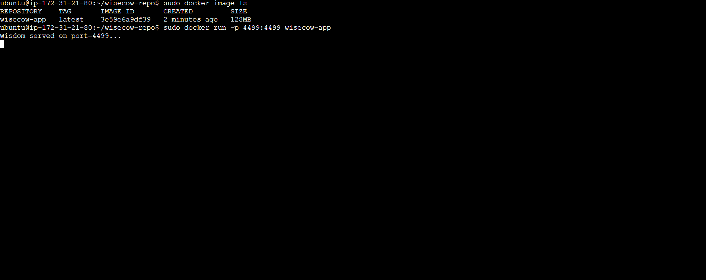
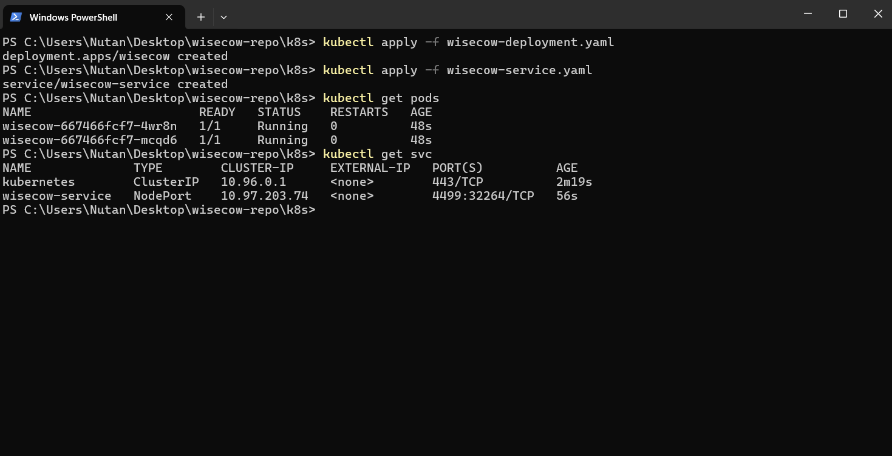

# Wisecow Application – DevOps Project

This project demonstrates **containerization, orchestration, CI/CD, and TLS** for the Wisecow application.

---

## 📌 Project Tasks

* ✅ **Dockerization** – Containerized Wisecow app with a Dockerfile.
* ✅ **Kubernetes Deployment** – Deployment + Service manifests for Wisecow.
* ✅ **CI/CD** – GitHub Actions workflow to build & push Docker images, with optional auto-deployment to Kubernetes.
* ✅ **TLS** – Secured Wisecow with HTTPS/TLS (challenge goal).

### 1️⃣ Dockerization

* Wrote a **Dockerfile** to containerize Wisecow.
* Built and tested the image locally:

```bash
docker build -t wisecow-app .
docker run -p 4499:4499 wisecow-app
```



---

### 2️⃣ Kubernetes Deployment

* Created **Deployment YAML** (`wisecow-deployment.yaml`) for the app.
* Created **Service YAML** (`wisecow-service.yaml`) to expose the app.
* Applied manifests:

```bash
kubectl apply -f wisecow-deployment.yaml
kubectl apply -f wisecow-service.yaml
```



---

### 3️⃣ CI/CD with GitHub Actions

* Added `.github/workflows/ci-cd.yml`.
* Workflow triggers on **git push**.
* Steps:

  1. Build Docker image.
  2. Push to Docker Hub / GitHub Container Registry.
  3. Deploy updated image to Kubernetes (optional challenge).

!\[GitHub Actions Workflow]\(images/github\_actions.png)

---

### 4️⃣ TLS Implementation (Challenge Goal)

* Installed **Ingress + Cert-Manager** for Kubernetes.
* Configured **Ingress** with TLS certificate.
* Verified Wisecow is accessible via HTTPS.

!\[TLS Secured Wisecow]\(images/tls\_https.png)

---

## 📊 Example Workflow

```mermaid
flowchart TD
  A[Git Push to Repo] --> B[GitHub Actions Workflow]
  B --> C[Build Docker Image]
  C --> D[Push to Registry]
  D --> E[Kubernetes Deployment Update]
  E --> F[Wisecow Accessible via TLS]
```

---

## 🚀 How to Run

Clone the repo:

```bash
git clone https://github.com/your-username/wisecow-devops.git
```

Apply Kubernetes manifests:

```bash
kubectl apply -f wisecow-deployment.yaml
kubectl apply -f wisecow-service.yaml
```

Access via:

```bash
kubectl get svc wisecow-service
```

---

## ✅ Deliverables

1. `Dockerfile`
2. `wisecow-deployment.yaml`
3. `wisecow-service.yaml`
4. `.github/workflows/ci-cd.yml`
5. `README.md` (with screenshots)
